# Allocators

Computers have a limited amount of RAM that you probably notice when seeing your computer has 16GB and Google Chrome consumes 3GB. But how does the browser 'consumes' memory? That's what will be seen in this chapter.

## Analogy

(from somethingelseentirely#3625)

* Automatic memory management is like taking the train to go places. You buy the ticket, leave where you want to go, but the train company takes care of putting the train back into its depot at night.
* Manual Memory Management is like a rental car. It is up to you to pick it up from the company, drive around with it, and then bring it back.
  Bad things happen when you loose the keys without returning it (you forgot to call free()), or when you brought it back to the company (the allocator) but forgot to pick up your kids from their thing (use after free()).
* Normally there is only one rental company in your entire area (in languages like Rust, which have a default allocator), but one of the cool things about zig is that there are multiple companies to choose from (that's why you can explicitly pass allocators around).
* Normally you pretend that there are always cars available at the company, but that means you're screwed when they don't have a car available. (Another cool thing about zig, the language forces you to handle the case where alloc/car rental, fails.)
* An areana allocator is just a special kind of car company, that tells you: "Hey you can park all the cars you rented from us in the same parking spot, and tell us where to find them at the end of the week, so no need to return each car one by one."
* The testing allocator is just a rental company for people who recently finished their driving lessons, so they will call you to remind you that you forgot to bring back the car, but since that's a very expensive service (in terms of performance), it's normally not something offered by regular rental companies, and for them "bad things happen TM". 

## Explanation

In computer programming, memory allocations are everywhere, simply adding an element to an array
(like `[1,2].push(3)` in JS) will cause allocations.  
What they are is simple, as said in the name, an allocation is when you allocate a chunk of memory
for some use. For that we'd use what's called an allocator, that tries to allocate memory such that two
variables don't get the same chunk.  
You can imagine it's like a landlord, selling an house from all the houses he own, and he must of course not sell
the same house twice.



(1 square = 1 byte)  
The little animation above shows how a very simple allocator with only 8 bytes of memory would work.
First, we allocate an `u32` (4 bytes), and then after it we allocate an `u16` (2 bytes).
If we tried to allocate another `u32` (4 bytes) we'd get *out of memory* (because 4+2+4 > 8)

In practice, most languages usually boil down to using a specific `malloc` function, which is a function provided by your system (libc) to allocate memory (which is much more complicated than what the animation shows).  
Zig on the other hand allows you to *choose* what allocator you want to use, and to allow that, it makes every allocation explicit, which goes hand in hand with Zig's zen of communicating intent precisely.

For example:

```zig
const allocator: std.mem.Allocator = std.heap.page_allocator;
```

Here `allocator` is a page allocator, it directly talks to the OS, without even using `malloc` and is incredibly inefficient.
For example, if you try to allocate an `u32`, it would allocate 4096 bytes even if we only use 4 bytes.

The allocator we'll most commonly use in zig is the GPA (General Purpose Allocator):

```zig
var gpa = std.heap.GeneralPurposeAllocator(.{}) {};
defer _ = gpa.deinit();
const allocator = gpa.allocator();
```

Here we have to keep `gpa` as it's the variable that will store the allocator's state, and then `allocator` is the interface we can use.
The general purpose allocator is, as its name implies, general purpose, so it should go for most of your programs, it also detects common memory errors (leaks, use-after-free, double free...)

`defer _ = gpa.deinit();` is a `defer` statement, which is very often used in Zig. It means that at the end of the current block (usually a function or loop) it will do `_ = gpa.deinit()`. In this case it means calling the GPA's function that allows to detect leaks and ignore its result.

### Practice: a list of grades

To apply our newly earned knowledge, we can code a simple yet useful program, computing the average
of your numerical grades

We start by setting up the allocator and the reader:

```zig
const std = @import("std");

pub fn main() !void {
    var gpa = std.heap.GeneralPurposeAllocator(.{}) {};
    const allocator = gpa.allocator();
    const reader = std.io.getStdIn().reader();
}
```

Then, in order to collect all grades, we're gonna use an [ArrayList](https://github.com/ziglang/zig/blob/master/lib/std/array_list.zig#L17) and start a loop:

```zig
var gpa = std.heap.GeneralPurposeAllocator(.{}) {};
const allocator = gpa.allocator();
const reader = std.io.getStdIn().reader();

var grades = std.ArrayList(f32).init(allocator);
defer grades.deinit();
while (true) {

}
```

`defer grades.deinit();` is a kind of statement that is very used in Zig. It means that at the end of the current block (usually a function or loop) it will call `grades.deinit()`. And `grades.deinit()` will free all the memory used up by the array list.

<div class="box-information">

To show how scopes work, you can see the following code

```zig
pub fn function() bool {
    var x: usize = 1;
    var isOkay = false;
    {
        defer isOkay = (x == 5);
        x *= 5;
        x += 2;
    }
    x /= 2;
    return isOkay;
}
```

is equivalent to:

```zig
pub fn function() bool {
    var x: usize = 1;
    var isOkay = false;
    {
        x *= 3;
        x += 2;
        isOkay = (x == 5);
    }
    x /= 2;
    return isOkay;
}
```

</div>

Next, we use [`reader.readUntilDelimiterAlloc`](https://github.com/ziglang/zig/blob/master/lib/std/io/reader.zig#L124)
to read a line of text from the input and then we parse it as a float if it isn't empty.
Finally we just do the sum of all grades and divide it by the number of grades to get the average.

Here is the full example ([grade2.zig](examples/grade2.zig))

```zig
const std = @import("std");

pub fn main() !void {
    var gpa = std.heap.GeneralPurposeAllocator(.{}) {};
    defer _ = gpa.deinit();
    const allocator = gpa.allocator();
    const reader = std.io.getStdIn().reader();

    var grades = std.ArrayList(f32).init(allocator);
    defer grades.deinit();
    while (true) {
        std.debug.print("Enter a grade: ", .{});
        const line = try reader.readUntilDelimiterAlloc(allocator, '\n', std.math.maxInt(usize));
        defer allocator.free(line);
        if (std.mem.eql(u8, line, "")) { // an empty line means we stop entering grades
            break;
        } else {
            const number = try std.fmt.parseFloat(f32, line);
            try grades.append(number);
        }
    }

    var sum: f32 = 0; // add all the grades
    for (grades.items) |grade| {
        sum += grade;
    }
    const average = sum / @intToFloat(f32, grades.items.len); // and divide by the number of grades
    std.debug.print("Your average is {d}\n", .{ average });
}
```

### Example: Handling an image

Being able to handle images is very important for making an image editor (from MS Paint to Photoshop)
or using them in an image viewer, a video game, etc.

A key property of an image is it's size, which is defined with a width and an height measured in
pixels.

[200x100 image]
legend: this is a 200x100 image

Images are (usually) made of [RGB](https://en.wikipedia.org/wiki/RGB_color_model) pixels coded on
24 bits.

For that we can use many concepts we saw earlier, first let's start small and define a pixel:

```zig
const Rgba = packed struct {
    red: u8,
    green: u8,
    blue: u8,

    /// Transparency
    alpha: u8
};
```

`packed struct` means that we define a struct that will have this precise bit-layout. If we just said
`struct`, Zig might have moved the bits and fields around.

```zig
const Image = struct {
    pixels: []Rgba,

    pub fn new(allocator: *std.mem.Allocator, width: usize, height: usize) !Image {
        const pixels = try allocator.alloc(Rgba, width * height);
        return Image { .pixels = pixels };
    }

}
```

Here we use a new integer type, `usize` which is 32-bit on a 32-bit machine and 64-bit on a 64-bit machine.
It is actually an integer the size of a pointer (in fact, `@ptrToInt` returns an `usize`).

`[]Rgb` is a slice of RGB colors and this is where slices come handy, because we don't know what will be
the width or height of the image we will create, and we wouldn't want to force the user to always use
images with a specific size! So we use a slice which also allows safety-checked arbitrary sizes.

Next we simply allocate `width * height` RGB pixels and use it for our `Image` struct and voilà.

This is quite good given that in C :

- we'd have to calculate the number of bytes to allocate using `sizeof`
- we'd have to not forget about error handling
- we wouldn't be able to change the allocator during execution
