<figure>
    
    <figcaption>Zig gotta go fast</figcaption>
</figure>

English version | Version française (à faire)

# Foreword

ZIG: Zig Isn't Gnu

This book targets people who already have experience programming in other
languages. Having experience in a systems programming language like C or
Rust can help but having something like intermediate level in Python is
enough to understand the book's concepts.

Being that the book is still very early, **if you have feedback, please tell me**
(you can send me a message on my Discord Zen1th#3854)

Complementary (free) material you might also want to use to learn Zig:

- [The language reference](https://ziglang.org/documentation/master/) which is of an awesome quality
- [Ziglearn](https://ziglearn.org) bare introductions in bullet list style
- [Ziglings](https://github.com/ratfactor/ziglings), like Rustlings but for Zig
- [Reading the standard library](https://github.com/ziglang/zig/tree/master/lib/std) because
it is really well written and serves as an example for many concepts and conventions in Zig.
- [Zig examples](https://github.com/Mouvedia/zig-examples/blob/main/zig.html.markdown)
- [Zig by example](https://zig-by-example.com/)

# Zig, Why?

TODO

The Road To Zig 1.0: [https://www.youtube.com/watch?v=Gv2I7qTux7g](https://www.youtube.com/watch?v=Gv2I7qTux7g)

# Introduction

## Installing Zig

The book targets `master` version (until 1.0 releases)

Download the Zig compiler from the [ziglang.org website](https://ziglang.org/download/),
selecting the OS and architecture you use. For example`zig-windows-x86_64`
on Windows 64-bit.

Then, you need to setup your PATH variable.

- Windows

System wide (admin Powershell):
```powershell
[Environment]::SetEnvironmentVariable(
   "Path",
   [Environment]::GetEnvironmentVariable("Path", "Machine") + ";C:\your-path\zig-windows-x86_64-your-version",
   "Machine"
)
```
User level (Powershell):
```powershell
[Environment]::SetEnvironmentVariable(
   "Path",
   [Environment]::GetEnvironmentVariable("Path", "User") + ";C:\your-path\zig-windows-x86_64-your-version",
   "User"
)
```
- Linux, macOS and BSD

You can add an export line to your shell startup script (.profile, .zshrc, …)
by adding the Zig install directory to the `PATH` variable.
```sh
export PATH=$PATH:~/path/to/zig-folder
```

## Hello World

In this chapter, our objective is to show \"Hello, World\" in the Zig
programming language.

We can start by declaring the main() function, the *main* function which
is run at the start of a Zig program.

```zig
pub fn main() void {
    
}
```

The syntax is quite simple, `fn main() void`. `void` shows the function
returns nothing. Finally, `pub` is necessary for a function to be
public, which means it can be used in other source files.

And finally, what we will put between `{` and `}` will be the code of
our function.

Making `main()` public (using `pub`) is necessary because the Zig standard
library, which is another source file will do *magic* in order to make your
`main()` function works. And in order to do that, it needs to access your
main function.

<div class="box-information">
Currently, the Zig compiler requires you to use spaces instead of tabs
and Unix line return (LF). On most editors, you can configure this in
the status bar (near the lower right-hand corner). If you use Notepad,
you can get a new editor like Notepad++ or Visual Studio Code, those are
free.
</div>

To see if this works, we must save this in a file, that could be named `hello.zig`.
Then we compile and run it using the `zig` command like the following:
```
$ zig run hello.zig
```

We can see that the program compiles but does nothing.
To print Hello World, we need to access the standard
output. First, we need to import the standard library using
`const std = @import("std");`. There, we declare a variable
(`const std = `) containing the standard library `@import("std");` Then,

From that, we can get `std.io.getStdOut().writer()` which allows
to use the **st**an**d**ard **out**put, this time we can put it in the
`main` function.

A writer is how you write data to a given destination (like a file, a network
stream, a terminal, ...) in Zig. Similarly, a reader allows to read data from a
given source.

``` { .zig .numberLines }
const std = @import("std");

pub fn main() void {
    const stdout = std.io.getStdOut().writer();
}
```

Then we can use the `print()` function that can be used to write text.
```zig
pub fn main() void {
    const stdout = std.io.getStdOut().writer();
    writer.print("Hello, World\n", .{});
}
```
Note that `\n` is a line return, adding it is necessary so that we can write another line after it.

Now you can try to compile the program, but we get.. an error!
```
$ zig run hello.zig
./hello.zig:5:17: error: error is ignored. consider using `try`, `catch`, or `if`
stdout.print("Hello, World\n", .{});
```
This informs us that `print` may return an error and that we cannot
ignore it. That is because in Zig, errors are just values, the only
difference is, special handling for it was made in the language to
make it easier to handle them.

We can use `catch` to manually handle the error, for example, to print an
error message without stopping the whole program, but here we'll just stop
the program and return the error to the caller.

```zig
stdout.print("Hello World\n", .{}) catch |err| return err;
```

The `try` keyword allows us to shorten this into
```zig
try stdout.print("Hello World\n", .{});
```

We try to compile and we get..
```
$ zig run hello.zig
./hello.zig:5:5: error: expected type 'void', found 'std.os.WriteError'
try stdout.print("Hello, World\n", .{});
    ^
./hello.zig:3:15: note: function cannot return an error
pub fn main() void {
              ^
```
The note helps us here:
we need to declare that the function can return an error. For this, we
can use the `!void` syntax which handles this for us. Finally, we have
```zig
const std = @import("std");

pub fn main() !void {
    const stdout = std.io.getStdOut().writer();
    try stdout.print("Hello, World\n", .{});
}
```
```
$ zig run hello.zig
Hello, World
```
The program now prints `Hello, World`.

# A deeper introduction

During this chapter, you will learn how does Zig handles basic management of your computer's memory.

## Variables

We already wrote variables in the last chapter, like `const stdout = std.io.getStdOut().writer();`

Except for a few special types, **all variables use a fixed number of bytes from the computer memory**.

This means all numbers use a fixed number of bytes.
For integers, that fixed number of bytes gives the maximum value of
a number. This is like if we had to write an integer in a limited
number of digits.

```zig
const a: i16 = -12345; // This is an integer that takes 16-bit
const b: i16 = 60000;  // This value is too large to fit in 16-bit and will make a compile error,
// So we can increase the bit size:
const c: i32 = 60000;  // yay!
```

There's also another trick to save on bytes: unsigned integers.

This means it can only store positive values
```zig
const a: u16 = 60000; // works
const b: u16 = 0;     // works
const c: u16 = -12;   // error!
```

In a sense, setting the bit size for your integer is like asserting that it will never go above the maximum value
and that it will never go below the minimum value.

<div class="box-information">
- For a signed number, if $n$ is the number of bits, the maximum value is $2^{n-1}-1$
while the minimum value is $-2^{n-1}$.
- For an unsigned number, the maximum value is $2^n-1$ and the minimum is always 0.

Example: the maximum value of a `u16` is $2^{16}-1 = 65535$
</div>

As a good default, you can just use `u32` and `u64` (unsigned) or `i32` and `i64` (signed).


## Floating point numbers

We want to swim but don't want to get cold. Fortunately,
we've got a thermometer that we put in the pool. But too bad, it gives results
only in Fahrenheit ! To avoid diving in too cold water, we could write a
program that can convert from Fahrenheit to Celsius degrees.

With a [quick search](https://en.wikipedia.org/wiki/Fahrenheit) we can
find the computation we need to do that: we substract 32 and divide by 1.8

However, 1.8 is not an integer :O !

To represent other numbers, there is what's called floating point numbers.
It's what's used when you write `var a = 1.8` in JavaScript. For our
temperatures, we can use something like `f64`. The `f` means it is a floating
point number, and `64` means it uses 64 bits.

```zig
const std = @import("std");

pub fn main() !void {
    const fahrenheit: f64 = 80;
    const celsius: f64 = (fahrenheit - 32) / 1.8;
}
```

The program is really simple to understand, `const fahrenheit: f64 = 80;`
is like how we defined variables before, except we added '`:f64`' which
says we want this variable to be an `f64`.
And then `(fahrenheit - 32) / 1.8` does the operation we described above.

## Printing numbers

The only thing left is printing the resulting value.

```zig
const std = @import("std");

pub fn main() !void {
    const fahrenheit: f64 = 80; 
    const celsius: f64 = (fahrenheit - 32) / 1.8;

    std.debug.print("{}°F is {}°C", .{ fahrenheit, celsius });
}
```

Using `std.debug.print` here is much shorter than using `std.io.getStdOut()`,
it also assumes we don't care if we can't show our text and will not error in
that case.

Here, `{}` is used to say we want to print the corresponding value we passed
in the `.{ fahrenheit, celsius }` argument. This way, the first `{}` gets
the first argument which is `fahrenheit` and the second `{}` gets the second
argument which is `celsius`.

Running the program gives us
```
8.0e+01°F is 2.66666679e+01°C
```

> Woops, looks like the result is in scientific notation :/

By default, Zig prints floating point numbers in scientific notation.

The `std.debug.print` function we use actually works using `std.fmt.format` underneath.

Looking for this function in [the standard library source code](https://github.com/ziglang/zig/blob/master/lib/std/fmt.zig#L27) which is easy to read and very useful, we find this:
```md
Renders fmt string with args, calling output with slices of bytes.
If `output` returns an error, the error is returned from `format` and
`output` is not called again.

The format string must be comptime known and may contain placeholders following
this format:
`{[argument][specifier]:[fill][alignment][width].[precision]}`

Each word between `[` and `]` is a parameter you can replace with something:
- *argument* is either the index or the name of the argument that should be inserted
- *specifier* is a type-dependent formatting option that determines how a type should formatted (see below)
[...]
- *precision* specifies how many decimals a formatted number should have

The *specifier* has several options for types:
[...]
  - `e`: output floating point value in scientific notation
  - `d`: output numeric value in decimal notation
[...]
```

This mean to get decimal notation, we can just use `{d}` in our program:
```zig
const std = @import("std");

pub fn main() !void {
    const fahrenheit: f64 = 80;
    const celsius: f64 = (fahrenheit - 32) / 1.8;
    const stdout = std.io.getStdOut().writer();

    try stdout.print("{d}°F is {d}°C", .{ fahrenheit, celsius });
}
```

The result is:
```
80°F is 26.666667938232422°C
```
Great!

Looking back at [the standard library source code](https://github.com/ziglang/zig/blob/master/lib/std/fmt.zig#L27),
we see we can use `precision` to round our number.
The change is as simple as using `{d:.1}` instead of `{d}`.

Which rounds the number and gives us:
```
80°F is 26.7°C
```
We can now safely dive in!

# Loops

## While loop

The `while` loop is very similar in Zig to other languages, it's used this way:
```zig
while (condition) {
    // Do something..
}
```
where `condition` is a `bool` value (`true` or `false`).
The following comparisons can be done and give a `bool` value:

| Condition |              Meaning              |
|-----------|-----------------------------------|
| `a == b`  | Tests equality between two values
| `a != b`  | Tests inequality between two values
| `a > b`   | `true` if `a` is higher than `b`
| `a >= b`  | `true` if `a` is higher or equals to `b`
| `a < b`   | `true` if `a` is lower than `b`
| `a <= b`  | `true` if `a` is lower or equals to `b`

Operators on `bool` values:

| Condition | Meaning |
|-----------|---------|
| `a and b`  | `true` if both `a` and `b` are equal to `true`
| `a or b`  | `true` if either `a` or `b` is equal to `true`
| `!a`  | [NOT](https://en.wikipedia.org/wiki/Inverter_(logic_gate)): `true` if `a` is `false`, `false` if `a` is true

For example:
```zig
var a: u32 = 9;
var b: u32 = 42;
while (b > a) {
    a += 1;
    b -= 1;
}
std.debug.print("Results are {} and {}\n", .{ a, b });
```
which will substract 1 from `b` and add 1 to `a` while `a` is higher than `b`

As `bool` are just regular values, we can also save them in variables:
```zig
const boolean = computeOneValue() > computeOtherValue();
std.debug.print("is one > other ? {}\n", .{ boolean });
```

## For loop

The `for` loop in Zig acts more like a for-each loop, that is it iterates over each
element of an array or a slice.

For example we can translate the following Javascript code:
```js
var items = [ 124, 135, 12, 95423, 10 ];
for (var item of items) {
    console.log(item);
}
```

to the following Zig code:
```zig
var items = [_]u32 { 124, 135, 12, 95423, 10 };
for (items) |item| {
    std.debug.print("{}\n", .{ item });
}
```

However, in the style of having only one *obvious* way to do things in Zig, the C-style for loop is absent:
```c
for (int i = 0; i < 10; i++) {
    printf("%d\n", i);
}
```
intuitively, it should be translated to:
```zig
var i: u32 = 0;
while (i < 10) : (i += 1) {
    std.debug.print("{}\n", .{ i });
}
```
Here, the instruction in parentheses after the while loop (`(i += 1)`) is executed at the end of each
loop.


# Functions

**This chapter needs serious rewrite.**

Now as you may know, it is often much better to break parts of the code that we'll use
often into functions.

For this, we use the same syntax we used for our main function:
here take our Fahrenheit to Celsius proram and turn the conversion into
a function:
```zig
fn fahrenheitToCelsius(fahrenheit: f32) f32 {
    return (fahrenheit - 32) / 1.8;
}
```

Parameters, like variables, have a name, `:` and then the type of the parameter. So here we say
we accept a `fahrenheit` parameter that MUST be an `f32`.

This contrasts with dynamic language (think Javascript or Python) where often you have to
check the correct type yourself which can be tiresome and error-prone (which is
why languages like TypeScript where made). Enforcing a paremeter's type is called static
typing. So we can say Zig is a statically typed language.

We can call a function using the usual parentheses syntax:
```zig
const celsius: f32 = fahrenheitToCelsius(80.0);
```

As there is no Object prototypes or operator overloading, the only way something can call
a function is with `theFunction()` syntax. This can help a lot in reading code by not
having to keep the mental overhead of what is overloaded, what's inherited by a class,
what prototype is it.

## Error handling in functions
error sets, `errdefer`, ...
...

# Slices

**This chapter needs serious rewrite.**

You may have noticed that Zig does have a syntax for arrays `[N]T` (where `N` is a number and
`T` a type) like `[100]u32` for 100 integers.

Cool, but real apps manipulate data that may have any size, right?


In C and Zig, arrays are fixed size as they are represented just as a lot of variables.
Meanwhile, slices are, like they name indicate, the slice of an array.

```
var array = [5]u8 { 1, 2, 3, 4, 5 };
var slice = array[0..5];
```

# The Zig, the String, and the Unicode

Now, one concerning fact about Zig is that strings are plain slices of bytes, which
means iterating over a string will actually iterate over bytes!

Does Zig not have support for UTF-8 ?

Well yes, and no. Zig has decided not to treat strings specially because really, there
is no correct way to do it.

For example, for iterating over a string, you might expect to iterate over a number of
characters? Problem is Unicode doesn't even define what a character is, and it might
range from a single byte to an entire
[grapheme cluster](https://www.unicode.org/reports/tr29/#Grapheme_Cluster_Boundaries).
For example, take
`"👩‍👦‍👦"`, what we see as a single character is actually made out of **5 codepoints**
(U+1F469 U+200D U+1F466 U+200D U+1F466) and each should be correctly preserved otherwise
we end up with a different emoji!

So, if your language has built-in Unicode support, what should it do ? Iterate over
codepoints ? over grapheme clusters ? What if I want to iterate through all of them ?
Is the Unicode table defining grapheme clusters (separators, joiners, etc.) always updated ?
That's why Zig leaves Unicode as something for standard library and other libraries to handle.

A simple example of thinking strings are simple and failing catatrosphically is JavaScript,
the programming language supposed to handle strings, but where `"👩‍👦‍👦".length` is equals to 8 !!
In almost all cases this is not the intented behaviour when getting a string's length. 
So really Javascript (and most languages that supposedly handle strings) trick you into believing
your code will work intuitively when in fact, human language is just complicated. Hence why,
like for many things, Zig wants you to think about what you want in order to get a correct behaviour.

For basic string manipulation, you'd look at `std.mem` and `std.ascii`, `std.mem` contains
useful functions like `indexOf` or `replace` while `std.ascii` contains ASCII-specific functions
(as its name suggests).

<div class="box-information">
The reason the namespace is `std.mem` and not not `std.string` is because thanks to generic
functions (see [Understanding Zig's comptime]) it also works on slices of any integer types.
So you can do `indexOf` on a `[]u32` without recoding it.
</div>

For Unicode-y things, you can use.. `std.unicode`. It contains methods for iterating over
[codepoints](https://en.wikipedia.org/wiki/Code_point), for encoding and decoding UTF-16 and UTF-8.

```zig
const str = "Forêt UTF-8 ⚡";

// it returns an error if 'str' is not valid UTF-8
var view = try std.unicode.Utf8View.init(str);
var iterator = view.iterator();

while (iterator.nextCodepoint()) |codepoint| {
    std.debug.print("{c}", .{ codepoint });
}
```

TODO: speak about string normalization and letter + accent instead of accented letter

Finally for more complex things, this is where Zig will need an external library, like many other
languages (yes, even those with that advertised Unicode support), notably for normalization which is
**very important** before storing a string because turns out a character can have multiple Unicode
representations, for *correctly* upper-casing or lower-casing a string which is complex because turns out
English isn't the only language in the world, and that letter case isn't universal (think Chinese), etc.

Zig currently has a good library for that, named [ziglyph](https://github.com/jecolon/ziglyph) it bundles
all needed Unicode data (thanks to comptime) and makes correct behaviour for Unicode characters.
It should be used for separating strings into grapheme clusters (necessary for most
[emojis](https://tonsky.me/blog/emoji/)) or string order, whether it's ascending or descending.

But really, in most cases, you should reconsider whether you really want to do those string operations
because, often, they [don't make sense in other languages](https://utf8everywhere.org/#myth.strlen).  
In fact, even with support for grapheme clusters there can be problems.
Think about "œ" (used in languages like French), it's one grapheme but two characters, yet you would
expect the reverse of "œuf" to be "fueo" (which would need special handling, imagine that for all
the characters in the world..) if we reverse it again, we get "oeuf" which, linguistically, isn't the
same word. So even in Latin languages, those job interviews string problems cause problems.

To conclude I'll ask you: what's the upper casing of नमस्ते👩‍👦‍👦שָׁלוֹם ?

# Pointers

**This chapter needs serious rewrite.**

We have a slice of some temperatures we want to convert to Celsius:
```zig
const temperatures = &[_]f32 { -40, 37.5, 100, 50 };
for (temperatures) |fahrenheit| {
    const celsius = convertTemperature(fahrenheit);

}
```


It's good to have values, so, let's try editing a value in a function:
```zig
fn convertTemperature(temperature: f32) void {
    temperature = (temperature - 32) / 1.8;
}
```

We can try calling it with
```zig
var temperature: f32 = 80.0;
convertTemperature(temperature);
```

And.. we get an error:
```
./example.zig:4:38: error: cannot assign to constant
    temperature = (temperature - 32) / 1.8;
```

It'd be nice if we could tell the function that we need to edit the variable in itself, not it's value. Right?

Well that's exactly what pointers do. It is the address to the value (which is what
a variable actually is).

[diagram of a computer memory, showcasing pointers as just addresses]

Zig has quite a few pointer types (where T is any type):

- `*T` is a pointer to a variable, this means we can ~~mutate~~ change the variable as much a we want, and the change will be correctly applied!
- `*const T` is a pointer to a *constant* value. This can be useful for large sized structs,
as a pointer is only 64-bit on a 64-bit machine, and 32-bit on a 32-bit machine. Yes, that's
what those bits are!

So let's update our example:
```zig
fn convertTemperature(temperature: *f32) void {
    temperature.* = (temperature.* - 32) / 1.8;
}

var temperature: f32 = 80.0;
convertTemperature(temperature);
```

`temperature.*` is called de-referencing a pointer. We know the *point*er is *point*ing to
a value, so dereferencing is used to get the value.
Thanks to the fact it's a pointer, we can edit the value in it with `temperature.* = ...` !

# Structs
...
boundfn, etc.

# Allocators

**This chapter needs serious rewrite.**

## Analogy

(from somethingelseentirely#3625)

* Automatic memory management is like taking the train to go places. You buy the ticket, leave where you want to go, but the train company takes care of putting the train back into its depot at night.
* Manual Memory Management is like a rental car. It is up to you to pick it up from the company, drive around with it, and then bring it back.
Bad things happen when you loose the keys without returning it (you forgot to call free()), or when you brought it back to the company (the allocator) but forgot to pick up your kids from their thing (use after free()).
* Normally there is only one rental company in your entire area (in languages like Rust, which have a default allocator), but one of the cool things about zig is that there are multiple companies to choose from (that's why you can explicitly pass allocators around).
* Normally you pretend that there are always cars available at the company, but that means you're screwed when they don't have a car available. (Another cool thing about zig, the language forces you to handle the case where alloc/car rental, fails.)
* An areana allocator is just a special kind of car company, that tells you: "Hey you can park all the cars you rented from us in the same parking spot, and tell us where to find them at the end of the week, so no need to return each car one by one."
* The testing allocator is just a rental company for people who recently finished their driving lessons, so they will call you to remind you that you forgot to bring back the car, but since that's a very expensive service (in terms of performance), it's normally not something offered by regular rental companies, and for them "bad things happen TM". 

## Explanation

In computer programming, memory allocations are everywhere, simply adding an element to an array
(like `[1,2].push(3)` in JS) will cause allocations.  
What they are is simple, as said in the name, an allocation is when you allocate a chunk of memory
for some use. For that we'd use what's called an allocator, that tries to allocate memory such that two
variables don't get the same chunk.  
You can imagine it's like a landlord, selling an house from all the houses he own, and he must of course not sell
the same house twice.

</img>

(1 square = 1 byte)  
The little animation above shows how a very simple allocator with only 8 bytes of memory would work.
First, we allocate an `u32` (4 bytes), and then after it we allocate an `u16` (2 bytes).
If we tried to allocate another `u32` (4 bytes) we'd get *out of memory* (because 4+2+4 > 8)

In practice, most languages usually boil down to using a specific `malloc` function, which is a function provided
by your system (libc) to allocate memory (which is much more complicated than what the animation shows).  
Zig on the other hand allows you to *choose* what allocator you want to use, and to allow that, it makes
every allocation explicit, which goes hand in hand with zig's zen of communicating intent precisely.

For example:
```zig
const allocator: std.mem.Allocator = std.heap.page_allocator;
```
Here `allocator` is a page allocator, it directly talks to the OS, without even using `malloc` and is incredibly
inefficient.
For example, if you try to allocate an `u32`, it would allocate 4096 bytes even if we only use 4 bytes.

The allocator we'll most commonly use in zig is the GPA (General Purpose Allocator):
```zig
var gpa = std.heap.GeneralPurposeAllocator(.{}) {};
defer _ = gpa.deinit();
const allocator = gpa.allocator();
```
Here we have to keep `gpa` as it's the variable that will store the allocator's state, and then
`allocator` is the interface we can use.
The general purpose allocator is, as its name implies, general purpose, so it should go for most
of your programs, it also detects common memory errors (leaks, use-after-free, double free...)

`defer _ = gpa.deinit();` is a `defer` statement, which is very often used in Zig. It means that at the
end of the current block (usually a function or loop) it will do `_ = gpa.deinit()`. In this case it means
calling the GPA's function that allows to detect leaks and ignore its result.

### Practice: a list of grades
To apply our newly earned knowledge, we can code a simple yet useful program, computing the average
of your numerical grades

We start by setting up the allocator and the reader:
```zig
const std = @import("std");

pub fn main() !void {
    var gpa = std.heap.GeneralPurposeAllocator(.{}) {};
    const allocator = gpa.allocator();
    const reader = std.io.getStdIn().reader();
}
```

Then, in order to collect all grades, we're gonna use an [ArrayList](https://github.com/ziglang/zig/blob/master/lib/std/array_list.zig#L17) and start a loop:
```zig
var gpa = std.heap.GeneralPurposeAllocator(.{}) {};
const allocator = gpa.allocator();
const reader = std.io.getStdIn().reader();

var grades = std.ArrayList(f32).init(allocator);
defer grades.deinit();
while (true) {

}
```
`defer grades.deinit();` is a kind of statement that is very often used in Zig. It means that at the
end of the current block (usually a function or loop) it will call `grades.deinit()`. And `grades.deinit()`
will free all the memory used up by the array list.

<div class="box-information">

To show how scopes work, you can see the following code
```zig
pub fn function() void {
    var x: usize = 1;
    {
        defer x += 2;
        x *= 5;
    }
    x /= 2;
    return x;
}
```
is equivalent to:
```zig
pub fn function() void {
    var x: usize = 1;
    {
        x *= 5;
        x += 2;
    }
    x /= 2;
    return x;
}
```
</div>

Next, we use [`reader.readUntilDelimiterAlloc`](https://github.com/ziglang/zig/blob/master/lib/std/io/reader.zig#L124)
to read a line of text from the input and then we parse it as a float if it isn't empty.
Finally we just do the sum of all grades and divide it by the number of grades to get the average.

Here is the full example ([grade2.zig](examples/grade2.zig))
```zig
const std = @import("std");

pub fn main() !void {
    var gpa = std.heap.GeneralPurposeAllocator(.{}) {};
    defer _ = gpa.deinit();
    const allocator = gpa.allocator();
    const reader = std.io.getStdIn().reader();

    var grades = std.ArrayList(f32).init(allocator);
    defer grades.deinit();
    while (true) {
        std.debug.print("Enter a grade: ", .{});
        const line = try reader.readUntilDelimiterAlloc(allocator, '\n', std.math.maxInt(usize));
        defer allocator.free(line);
        if (std.mem.eql(u8, line, "")) { // empty line means we stop entering grades
            break;
        } else {
            const number = try std.fmt.parseFloat(f32, line);
            try grades.append(number);
        }
    }

    var sum: f32 = 0; // add all the grades
    for (grades.items) |grade| {
        sum += grade;
    }
    const average = sum / @intToFloat(f32, grades.items.len); // and divide by the number of grades
    std.debug.print("Your average is {d}\n", .{ average });
}
```


### Example: Handling an image

Being able to handle images is very important for making an image editor (from MS Paint to Photoshop)
or using them in an image viewer, a video game, etc.

A key property of an image is it's size, which is defined with a width and an height measured in
pixels.

[200x100 image]
legend: this is a 200x100 image

Images are (usually) made of [RGB](https://en.wikipedia.org/wiki/RGB_color_model) pixels coded on
24 bits.

For that we can use many concepts we saw earlier, first let's start small and define a pixel:
```zig
const Rgba = packed struct {
    red: u8,
    green: u8,
    blue: u8,

    /// Transparency
    alpha: u8
};
```

`packed struct` means that we define a struct that will have this precise bit-layout. If we just said
`struct`, Zig might have moved the bits and fields around.

```zig
const Image = struct {
    pixels: []Rgba,

    pub fn new(allocator: *std.mem.Allocator, width: usize, height: usize) !Image {
        const pixels = try allocator.alloc(Rgba, width * height);
        return Image { .pixels = pixels };
    }

}
```
Here we use a new integer type, `usize` which is 32-bit on a 32-bit machine and 64-bit on a 64-bit machine.
It is actually an integer the size of a pointer (in fact, `@ptrToInt` returns an `usize`).

`[]Rgb` is a slice of RGB colors and this is where slices come handy, because we don't know what will be
the width or height of the image we will create, and we wouldn't want to force the user to always use
images with a specific size! So we use a slice which also allows safety-checked arbitrary sizes.

Next we simply allocate `width * height` RGB pixels and use it for our `Image` struct and voilà.

This is quite good given that in C :

- we'd have to calculate the number of bytes to allocate using `sizeof`
- we'd have to not forget about error handling
- we wouldn't be able to change the allocator during execution


# Proper input and output

## Reader
### Improving upon our converter program
...

std.io.readUntilDelimited, std.fmt.parseFloat

# Understanding Zig's comptime

One of Zig's particularities is that it brings a new concept called compile-time code
execution. To use this, we simply tell Zig that we want to execute some specific functions
when the code is being compiled. So that when we compile the code, code is executed and we
can use what it returned as constant data.

For example, the standard library uses this simple concept to make [generics](https://github.com/ziglang/zig/blob/master/lib/std/array_list.zig) and [type-erased functions](https://github.com/ziglang/zig/blob/master/lib/std/math.zig#L472) and you too will be able to do so later in this chapter.

<div class="box-information">
Something that is known at compile-time simply means it can be entirely computed during
the compilation without depending on anything external to it. Basically, this
means that if you read a file or look up google.com, it is NOT known at compile-time.
</div>

Compile time code execution can be divided in a few core concepts:

## A type is just yet another variable

As you know, in Zig every variable has an unchangeable type
that is kept throughout its whole lifetime. For example when declaring `const a: u32 = 0`,
`u32` is the variable's type.

Now the new thing is that the type of `u32` would simply be `type`,
type of `f64` would also be `type`, etc.

In practice, this means that we can store types in constants:
```zig
const MyFavouriteInteger = u32;
```

The only constraint is that it MUST be known at compile time.
This means the below code would NOT work:
```zig
var someValue = computeThings();
var MyType: ?type = null;

if (someValue < 10) {
    MyType = u32;
} else {
    MyType = bool;
}
```

However, we can make it depend on compile-time known values:
```zig
const someValue = 5;
const MyType = if (someValue < 10) u32
    else bool;

var someVariable: MyType = undefined;
```
Here, `someValue` is known to be 5 at compile-time, so the compiler replaces
```zig
const MyType = if (someValue < 10) u32
    else bool;
```
with
```zig
const MyType = u32;
```
and so `someVariable` will be a `u32`.

And then it can be used like anything else!
```zig
var someInt: MyType = 5; // this will be a 'u32' variable
```

## You can execute functions at compile-time

<div class="box-information">
For short, you can say comptime instead of compile-time.
</div>

The second concept is that functions can be executed at compile-time
as long as its arguments are known during comptime. If it's the case
we can just add `comptime` to the function call:

```zig
fn factorial(x: u32) u32 {
    if (x == 0) return 1;
    return x * factorial(x - 1);
}

const result = comptime factorial(5);
if (result != 120) {
    @compileError("Mathematics just broke.");
}
```

Here, as we explicitely said to execute it at compile-time using `comptime`, the
`factorial` is executed during compilation. If we remove `comptime`, it would
still be executed at compile-time if the compiler finds it's necessary.

What this means in practice is that in the final executable, there won't be any code
for computing the [factorial](https://en.wikipedia.org/wiki/Factorial) of 5, instead it will be like if we replaced
```zig
const result = comptime factorial(5);
```
with
```zig
const result = 120;
```

The major difference is that we keep the convenience of calling `factorial`
so we explicitely know it's `factorial(5)` and not some magic `120` value.

This also means if one day we want to change the value, it's much easier. For small
things like that it might not matter much, but this feature can be extended to generate
**entire images** in compile-time, and there it's much better to easily tweak parameters.

Another interesting part is
```zig
if (result != 120) {
    @compileError("Mathematics just broke.");
}
```
Now this simply means that if factorial of 5 is not equals to 120, we make a
compile error.

Also, given the value only needs to be known at comptime, we can do something like
```zig
const result = comptime factorial(factorial(3));
```
This will find that factorial(3) = 6 and that factorial(6) = 720, so this will be replaced with
```zig
const result = 720;
```

Something as simple as that would better be replaced with Zig testing (coming soon chapter)
but there are major cases where it can be used:
```zig
const builtin = @import("builtin");

fn doSomeAppleThing() void {
    if (!builtin.os.isDarwin()) {
        @compileError("You're not compiling for Apple platform >_<");
    }
    // we can now be bare Metal, pun intended
}
```

If we call this function and try to compile the program for Windows, the compiler will
show an error: You're not compiling for Apple platform >\_<

What's happening is that we called the `isDarwin()` function (which returns false if
if we're not compiling for iOS, macOS, and others) and we were able to make a compile error
out of it.

When defining a function, you might also want to declare a parameter as
`comptime`, this as the effect to force the parameter to be known at
compile-time, and if it is not possible, the compiler will simply output an error.

## What can be done with it

From all the above points, we can easily make something like this:
```zig
pub fn MyType(comptime OtherType: type) type {
    return struct {
        pub fn returnValue(value: OtherType) OtherType {
            return value;
        }
    }
}
```
Admitedly, this `returnValue` function is not very useful, but the above code
already shows quite a few things:

- We defined a function `MyType` that takes a `type` as input and returns another
`type`. The type we take as argument can be anything, and we return a struct from
the function.
- We can use `OtherType` argument like an `u32`, an `f64`, those are types and so is
`OtherType` !

We can make something more useful, like a basic list:
```zig
pub fn List(comptime T: type) type {
    return struct {
        items: []T,

        const Self = @This();

        pub fn get(self: *Self, index: usize) T {
            return self.items[index];
        }
    }
}
```
As said above, we can use our type parameter (which here is named `T`) as any other type,
so we use it to declare a field `items: []T`. The `get` function is also simple. What's
worth noting is the `@This()`. It simply returns the type we're in. As can be seen,
we're making a struct type, so `@This()` references the struct type. For example,
you can think of `const Self = @This()` as `const Self = List(T)`.

Then using allocators you saw in the 'More Memory' chapter, we can make a simple array list:
```zig
pub fn ArrayList(comptime T: type) type {
    return struct {
        items: []T,
        allocator: *Allocator,

        const Self = @This();

        pub fn append(self: *Self, value: T) !void {
            // We expand our item list
            self.items = try self.allocator.realloc(items, items.len + 1);

            // And we set the newly allocated space to the new value
            self.items[self.items.len - 1] = value;
        }
    };
}
```
And we can add an init function to make it easier to use:
```zig
pub fn init(allocator: *Allocator) Self {
    return Self {
        .allocator = allocator,
        .items = allocator.alloc(T, 0) catch unreachable // can't fail as we're literally allocating no memory
    }
}
```

And like this, we can use it as any other type:
```zig
var list = ArrayList(f64).init(allocator);
try list.append(6.3);
```

We can even put the result in a constant:
```zig
const MyList = ArrayList(f64);

var list = MyList.init(allocator);
try list.append(6.3);
```

Of course, this list could be made much better, but it's great as an overview of how "generics" like
`std.ArrayList` and other types actually work.

`type`, `anytype`, ...

## (Huge) Practical example: coding an operation parser

Now, you know Zig doesn't have operator overloading for entirely valid reasons, but when
implementing vector maths or trying to use matrixes, it can quickly become a parentheses
hell bringing among the oldest Lisp-nam war flashbacks and PTSD (`a.add(b.mul(c.normalize().add(d)))`).

Now the task we're gonna do is complicated and hard to think about, but the day you fully
understand that, you know the power of compile-time code execution.

As we know, `std.fmt.format` parses the format string at compile-time, so here we can
take a try at extending the language using comptime !

Our end goal is being able to write something like
```zig
operload("a + ( b * ( normalize c + d ) )",
    .{ .a = a, .b = b, .c = c, .d = d });
```

For simplicity, we will not take care of operator precedence (the fact that we
do multiplications first and then we do additions) in order to make parsing simpler given
it's not the main topic here.

We can quickly devise a parser where the root node is an Expression.

An expression can be either an unary operation (like `normalize c`) or a binary
operation (like `a + ( b * ... )`).

For that we can build a simple state machine that will match for every word:

- If we encounter an operator, this means we're at the start of an unary
expression, so we parse the next expression and make that.
- If we encounter a variable, this means we're at the start of a binary
expression (`a`), so we parse the following operator (`+`) and the following
expression (`b`) to get `a + b`.

We'll also store a list of comptime 

So we can start coding,
```zig
// for now, we will assume the end result is a Vector3
pub fn operload(comptime str: []const u8, args: anytype) Vector3 {

}
```

First we'll start by splitting our input word by word (if we were doing actual parsing,
we wouldn't do that):
```zig
pub fn operload(comptime str: []const u8, args: anytype) Vector3 {
    comptime {
        var split = std.mem.split(u8, str, " ");
        while (split.next()) |word| {

        }
    }
}
```

And we can fully make it a state machine:
```zig
const ParserState = enum {
    Start,
    StartBinaryOp,
};

/// Returns whether 'word' corresponds to a variable defined in 'args'
fn isVariable(comptime word: []const u8, comptime T: type) bool {
    return @hasField(T, word);
}

pub fn operload(comptime str: []const u8, args: anytype) Vector3 {
    comptime {
        var state = ParserState.Start;
        var split = std.mem.split(u8, str, " ");

        while (split.next()) |word| {
            switch (state) {
                .Start => {
                    if (isVariable(word, @TypeOf(args))) {
                        state = .StartBinaryOp;
                    } else {
                        @compileError("We don't know how to handle that yet!");
                    }
                },
                .StartBinaryOp => {} // TODO
            }
        }
    }
}
```


# bad writing graveyard

Memory - Variables:

Imagine, because we have limited space on our desk, we use in a tiny screen
which can only show up to 4 digits, it's easy to guess our maximum number
is 9999. This would work to show a tiny number like the number of
notifications you have on a phone. If we used a signed number, using
the same space, the maximum and minimum would be +999 and -999.

However we can't use it to show the world population (\~8 billion),
so we can use again the smallest screen, but that is able to fit a number
like 8 billion, which would be a screen with 10 digits. We don't need 11
digits as we know the world population cannot be negative. (it wouldn't
make any sense), thus we saved on some space!

And like this we did the exact same process as thinking about how many bytes a
number should have.

In practice, the number of digits is replaced by the number of bits.
The maximum and minimum value, like in the above analogy, depend on
whether it is a signed or an unsigned number.

# TODO

utilité erreur "unused variable":
you copy-pasted a test case:
```zig
var rect = Rect(.{ .color = Color.blue });
std.testing.expectEqual(Color.blue, rect.color);

var rect2 = Rect(.{ .color = Color.yellow });
std.testing.expectEqual(Color.yellow, rect.color);
```
This looks perfectly fine to run! Except not, we did a typo (`rect` instead of `rect2`) and the test will fail,
Zig avoids this by making unused variables an error, it can feel like a pain, but it can save you from a lot of
bugs like this.